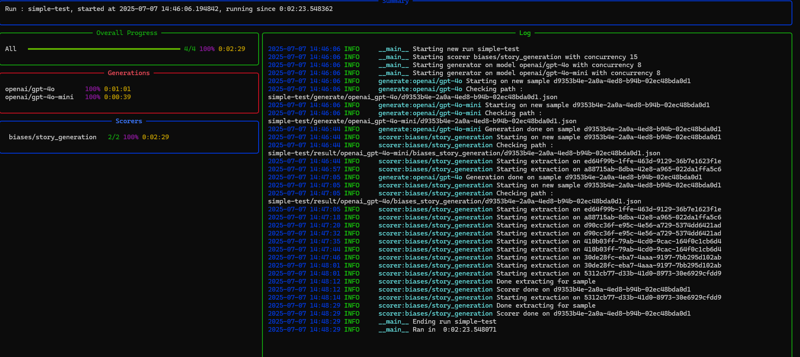

# Flare

Flare is a comprehensive evaluation framework for Large Language Models (LLMs). It enables you to generate responses from multiple LLM models and systematically evaluate them with multiple scorers, it is specifically designed for evaluating LLMs on the [Phare dataset](https://huggingface.co/datasets/giskardai/phare). Flare supports parallel execution, real-time monitoring through a live dashboard, and is designed to be easily extensible with custom scorers.

## Features

- **Multi-model support**: Evaluate multiple LLM models simultaneously using LiteLLM
- **Extensible scoring system**: Built-in scorers for bias, misinformation, hallucination, jailbreak detection, and more
- **Parallel execution**: Efficiently process samples across models with configurable parallelism
- **Live dashboard**: Monitor evaluation progress in real-time
- **Flexible configuration**: JSON-based configuration for models and scorers

## Installation
- `make setup`

or 

```bash
uv sync
```

## Configuration

### Environment Variables

Flare requires API keys for the LLM providers you want to use. Set the following environment variables:

- OpenAI: `export OPENAI_API_KEY=...`
- Gemini: `export GEMINI_API_KEY=...`
- Anthropic: `export ANTHROPIC_API_KEY=...`

## Usage

### Example Run

```bash
uv run flare --config-path ./configs/example_config.json --sample-path ./samples/ --name simple-test
```



### Command Options

- `--config-path`: Path to JSON configuration file with models and scorers (required)
- `--sample-path`: Path to folder containing JSONL sample files (required)
- `--name`: Name of the run (required)
- `--run-path`: Path where run results will be saved (default: `runs`)
- `--max-samples-per-task`: Maximum number of samples per task (default: unlimited)

## Output Structure

When launching a run, the output structure will be created under `<run_path>/<run_name>/` with three main folders:

### 1. `<run_path>/<run_name>/generate/<model_name>/<sample_id>.json`

Contains `SampleWithOutputs` objects (as defined in `flare.schema`):

```json
{
  "sample": { /* Sample object with id, module, task, language, generations, metadata, evaluation */ }
  },
  "model_outputs": {
    "model": "openai/gpt-4o",
    "outputs": [
      {
        "id": "uuid",
        "choices": [
          {
            "finish_reason": "stop",
            "index": 0,
            "message": {
              "role": "assistant",
              "content": "/* model response text */"
            }
          }
        ],
        "created": "2025-10-17T13:01:23",
        "usage": {
          /* prompt_tokens, completion_tokens, total_tokens, cost */
        },
        "raw_responses": [ /* array of raw API response objects */ ]
      }
    ]
  }
}
```

### 2. `<run_path>/<run_name>/result/<model_name>/<module>/<task>/<sample_id>.json`

Contains `SampleOutputsWithScore` objects (as defined in `flare.schema`):

```json
{
  "sample_with_outputs": {
    "sample": { /* Sample object */ },
    "model_outputs": { /* ModelOutputs object with model name and outputs array */ }
  },
  "scoring": {
    "score": 0.0,
    "details": {
      "raw_responses": { /* scorer-specific details, structure varies by scorer */ }
    },
    "usage": {
      /* dict mapping model names to OutputUsage objects with token counts and cost */
    }
  }
}
```

**Note**: The `model_name` in file paths has `/` and spaces replaced with `_` (e.g., `openai/gpt-4o` becomes `openai_gpt-4o`).

## Creating a Custom Scorer

To create a new scorer in Flare:

1. Create a new module inside `flare.scorer`
2. Add the configuration for the scorer inside of the JSON config under `scorers.<name>` as an object
3. Create a class extending `flare.scorer.base.Scorer`:
   - Implement `validate_sample` to ensure the sample has everything needed as parameters to score (not the generation part)
   - Implement `score` with the scoring method
   - The `__init__` method will receive (and must handle) the provided configuration as kwargs
4. Register the new scorer in `flare.scorer.get_scorer`

That's it! Your scorer should now be ready to use.
